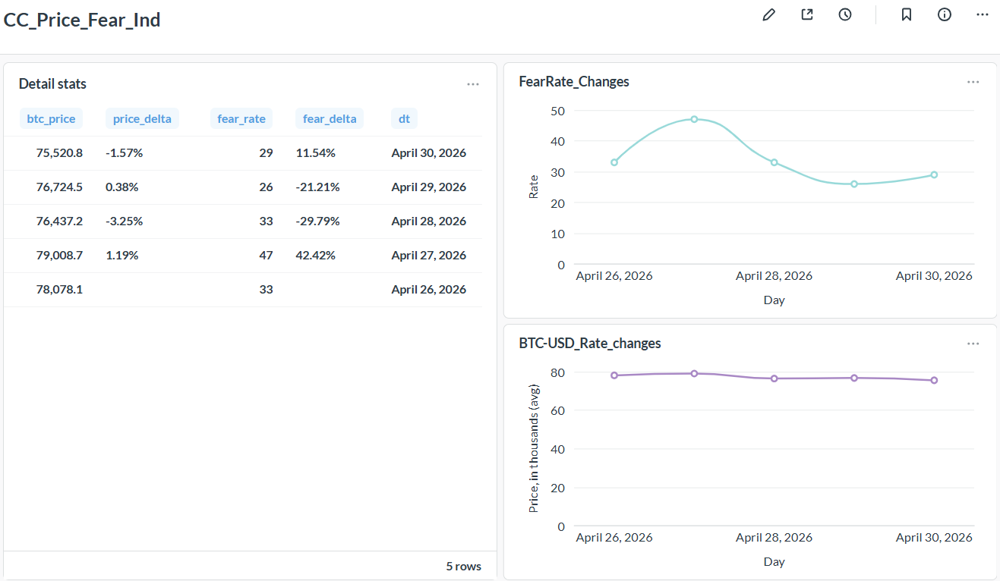

# de-proj-prtf
The project's goal is to show how "Fear and Greed Index" depends on price of BTC.

It is implemented in next steps:
- collecting data from crypto broker (OKX) and Alternative.me (as a source of "Fear and Greed Index") via API
- transforming collected data
- saving transformed data in the database
- visualizing the data using Metabase (BI agent)

The process is implemented with Airflow.
There are three DAGs:
- init-DAG (creates a schema and tables)
- OKX-data DAG (collects data from the broker hourly)
- "Fear and Greed Index"-DAG (collects data from Alternative.me daily)

Once the data are collected, it is visualized via Metabase.
There is a dashboard with made of two graphs (BTC-price and the Index) and a table with statistics.

It is a file in the project folder with data collected for 5 days to be used for visualize.

Answering the question if "Fear and Greed Index" depends on price of BTC, I could say that there is a
  correlation between BTC's price and the Index, though it seems the Index requires some time to show this dependency.

I have made a screenshot of the dashboard and what it should look like (the more data collected the more precise it will be)
